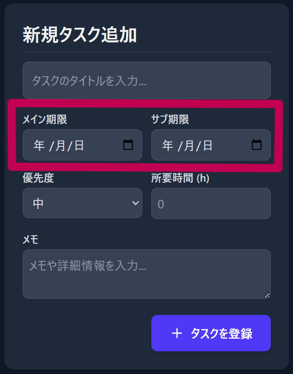
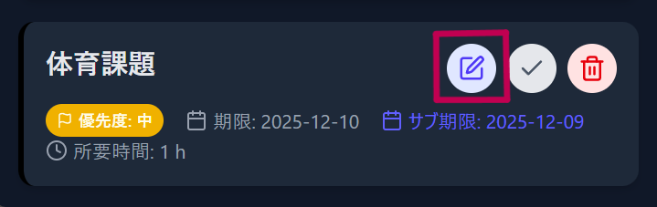
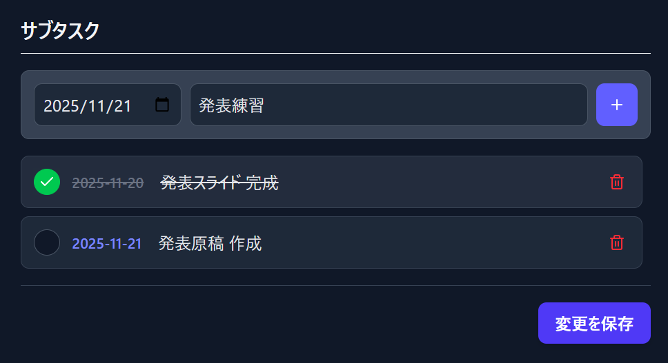
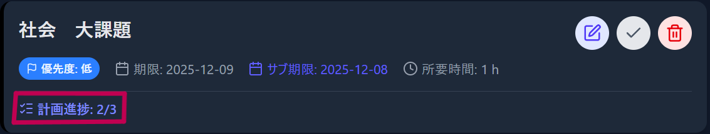
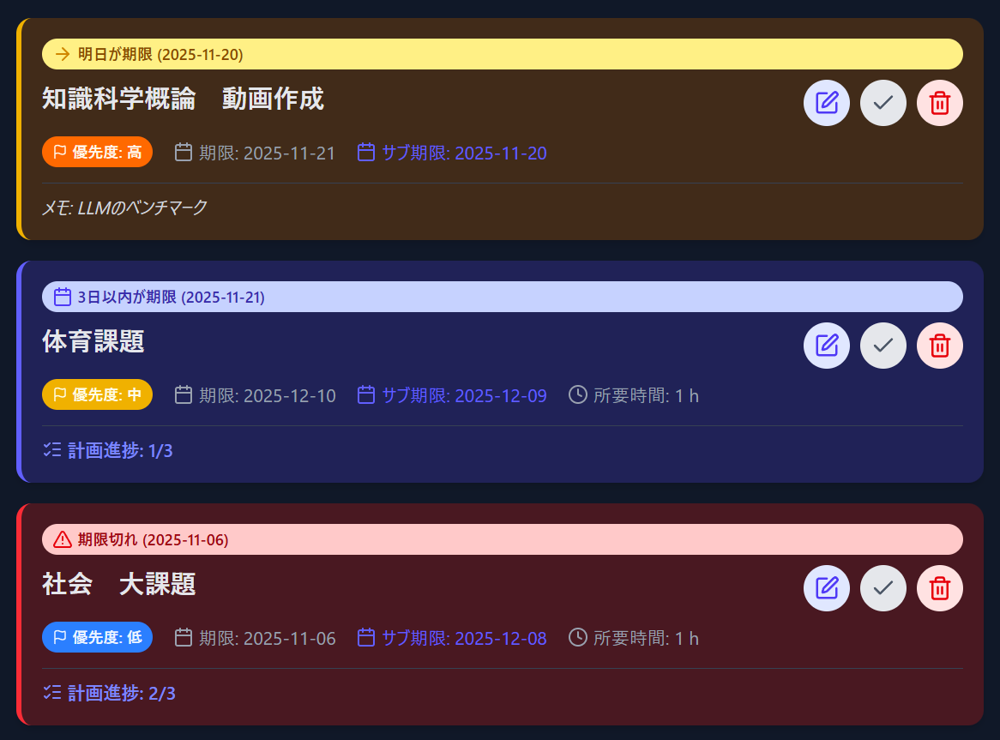
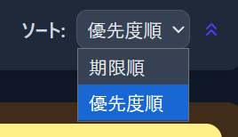
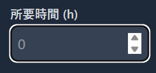
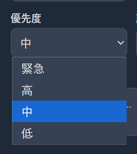

# 📅 タスク管理  ToDoアプリ

## 🔗 アプリケーションの公開URL

**GitHub Pages URL:** `https://an-nn-t.github.io/react-todo-app/`

---

## アプリ概要

本アプリケーションは、課題やタスクを直前までためてしまう習慣を克服し、計画性を身につけるために作成しました。単なる期限管理に留まらず、タスクを最小単位に細分化し、進捗を可視化することで、確実なタスク実行をサポートするタスク管理・ToDoアプリです。

---

## 工夫点

### サブ期限機能
一般的なToDoアプリは期限を1つしか設定できないため、期限の直前まで手を付けず直前に焦ることがよくあります。そこで、このToDoアプリでは「ここまでに終わらせたい」という自分用の目標期限（サブ期限）も設定できるようにしました。

### サブタスク機能
タスクを段階ごとに分割し、「いつまでに」「何をやるか」を細かく設定できます。編集ボタンからサブタスクを追加すると、大きなタスクを日付と内容ごとに整理でき、進捗も一目で確認できます。これにより、作業を日単位で計画的に進められます。

### アラート機能
メイン期限、サブ期限、日々の計画（サブタスク）の中で最も近い期限を自動検出し、**今日、明日、3日以内、期限切れ**を自動で視覚的にハイライトします。

### ソート機能

### 所要時間

### 優先度

---

## 使用技術

| 技術 / ツール | 用途 |
| :--- | :--- |
| **言語** | TypeScript, JavaScript, HTML, CSS |
| **フレームワーク/ライブラリ** | React (Hooks: `useState`, `useEffect`, `useCallback`, `useMemo`) |
| **スタイリング** | Tailwind CSS |
| **アイコン** | Lucide React |
| **データ永続化** | Local Storage (ブラウザ内ストレージ) |
| **ホスティング** | GitHub Pages |

## ⏱ 開発期間と取り組み時間
**開発期間:** 2025.11.10 ~ 2025.11.19（約20時間）
